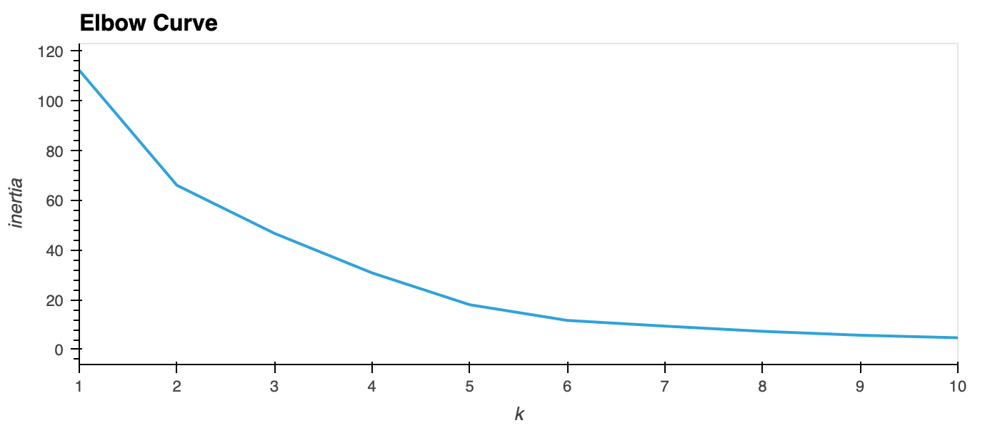
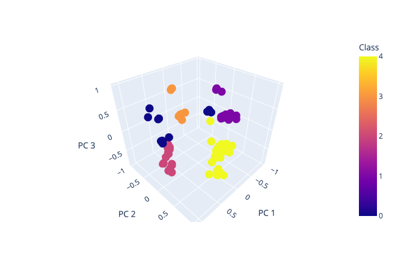

# Cryptocurrency-Clustering-Analysis

## Summary

Cryptocurrencies have exploded in recent years and have had massive growth with a total market cap near 3 trillion dollar at its peak in 2021. Unfortunately due to the nature of its existence and unregulated nature the addition of new coins and tokens everyday. This notebook employs machine learning methods to attempt and cluster all the available working and currently trading cryptocurrencies in the market.

## Objective

Pull a list of all available cryptocurrencies in the market and apply some data processing and cleaning prior to running an Unsupervised clustering method (K-Means) in order to group various crypto assets and help in deciding what to invest in and what can be avoided as well.

## Methodology

- Aggregate the list of crypto's from an [API provider](https://min-api.cryptocompare.com/data/all/coinlist)
- Clean and prepare the dataset to be consumed by the k-means algorithm :

  - We first start by removing unneeded columns and keep only relevant information in order to avoid complicating the modeling
  - Keep only trading currency pairs
  - Remove all currencies that have null values
  - Remove those with no mined coins so far
- Once our list is cleaned we can rename keep it as our features list and convert all text based information into numerical values by using the pandas.get_dummies() function or any other text encoder function.
- Reduce the feature dimensions by using Principal Component Analysis (PCA) , this is done to help optimize the modeling and training of this dataset using the K-Means Algorithm.
- An Elbow plot was constructed as well to help in determining the optimal number of cluster classes to use and value of K=5 was used for the code. feel free to rerun with different values as well.

- Once the data was clustered and since we can visualize it as below and can clearly see some coin clusters based on the features passed to the model which were

| Algorithm | ProofType | TotalCoinsMined | MaxSupply | CirculatingSupply |
| --------: | --------: | --------------: | --------: | ----------------: |

## Conclusion and Results

By using the K-Means clustering algorithm we are able to group the various cryptocurrency assets and have a better way of identifying which assets belong to the same group as Bitcoin and thus use that knowledge to narrow down our investment options.

Further work can be done to plot the price performance per group and build an basket of assets to invest in.
